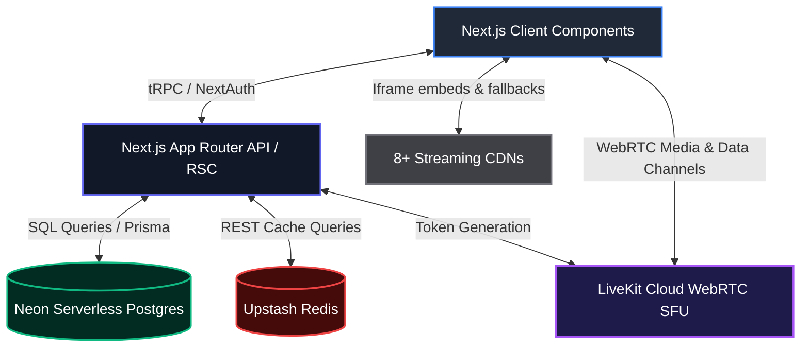

# 🎓 LandeMon: Comprehensive Interview & Architecture Guide

Welcome to the official LandeMon technical interview and architectural guide. This document serves as a complete deep dive into the engineering choices, trade-offs, codebases, and systems design of LandeMon. It is designed to prepare you to answer any "How," "Why," and "What" questions regarding this project.

---

## 🗺️ Architectural Blueprint

LandeMon is designed with a **Serverless-First, Edge-Optimized Hybrid Architecture**.



### High-Level Data Flows
1. **Metadata & Streaming Info**: The client requests metadata. The Next.js server checks [Upstash Redis](src/lib/cache.ts) for TMDb cached items. On a miss, it fetches from TMDb, writes to Redis in the background, and returns.
2. **Streaming Fallbacks**: The client attempts to fetch stream links. Depending on the environment, the server pings providers or the client conducts in-browser iframe testing.
3. **Watch Parties**: The host creates a room via `/api/party/create` which is stored in Redis. The client establishes a direct WebRTC connection with LiveKit SFU using a JWT generated by Next.js. State synchronization and chat are handled via **LiveKit Data Channels**.

---

## ⚡ Technical Deep-Dives: How, Why & Trade-offs

---

### 1. Watch Party Synchronization (LiveKit WebRTC)

#### ❓ How it works:
When a host launches a Watch Party, the server generates a 6-character room key and stores it in Redis. Guests who join are connected to the same LiveKit room. 
- Real-time video and audio feeds of the participants are handled via LiveKit's SFU.
- Playback states (e.g., play, pause, seek, current video provider, season/episode) are synchronized using **LiveKit Data Channels** (`sync`).
- When a guest connects, they broadcast a `REQUEST_SYNC` channel message. The host listens, serializes the current video state, and responds with a `STATE_SYNC` message containing current playback time, server provider, season, and episode.
- The host can also broadcast a `SYNC` event, initiating a visual **3-2-1 countdown** on all guest players to guarantee simultaneous playback start.

Check the implementation details in:
- [watch-party-client.tsx](src/components/party/watch-party-client.tsx)
- [sync-controls.tsx](src/components/party/sync-controls.tsx)
- [sync-notification.tsx](src/components/party/sync-notification.tsx)

#### 🛠️ Why it was implemented this way:
- **SFU vs. Peer-to-Peer Mesh (e.g. PeerJS)**: In a pure P2P mesh network, every user must send their video/audio streams to every other user. For $N$ users, the upload bandwidth scales at $O(N^2)$, which crashes mobile devices. LiveKit operates as a **Selective Forwarding Unit (SFU)**. Every user uploads their stream once to the SFU, which distributes it ($O(N)$ upload bandwidth).
- **UDP Data Channels vs. WebSockets (Socket.io/Pusher)**: Standard WebSockets run over TCP, introducing head-of-line blocking and requiring a persistent server. LiveKit Data Channels use WebRTC data channels running over SCTP/UDP, guaranteeing sub-millisecond, low-overhead sync packets. Furthermore, this approach avoids running a stateful Node.js WebSocket server, fitting perfectly into Vercel's serverless environment.

---

### 2. The Screen Share "Theater Mode" Hack

#### ❓ How it works:
When a host wants to share their movie stream via WebRTC Screen Share:
1. They click the **Theater** button on the bottom bar of [control-bar.tsx](src/components/party/control-bar.tsx).
2. This opens a popup window (`/party/[roomId]/theater`) which strips away the chat panel, headers, webcams, and footer controls, rendering only the raw video player.
3. The host shares *only* this pop-out window using the browser's screen selector.

#### 🛠️ Why it was implemented this way:
- **Infinity Mirror Prevention**: If the host shares their primary screen, the screen share feed captures the watch party page itself, creating a recursive "infinity mirror" loop. Pop-out Theater Mode restricts the capture to only the video iframe.
- **System Audio Capture**: Modern browsers allow selecting a specific window or tab to share with system audio. By isolating the player in its own window, the host can check "Share system audio" safely without broadcasting notification sounds from their main desktop workspace.

---

### 3. Edge Caching with Upstash Redis

#### ❓ How it works:
Every TMDb API call is wrapped in a generalized Read-Through Cache utility located at [cache.ts](src/lib/cache.ts):

```typescript
export async function getCached<T>(
  key: string,
  ttlSeconds: number,
  fetchFn: () => Promise<T>
): Promise<T> {
  const versionedKey = `v3:${key}`;
  if (!redis) return fetchFn(); // Client-side fallback

  try {
    const cachedData = await redis.get<T>(versionedKey);
    if (cachedData) return cachedData; // Cache HIT

    const freshData = await fetchFn(); // Cache MISS
    if (freshData) {
      // Background cache-write: Promise.resolve wraps this so we don't block the client
      Promise.resolve(
        redis.set(versionedKey, freshData, { ex: ttlSeconds })
      ).catch(err => console.error(err));
    }
    return freshData;
  } catch (error) {
    return fetchFn(); // Graceful degradation on Redis failure
  }
}
```

#### 🛠️ Why it was implemented this way:
- **HTTP REST-based Redis (Upstash) vs. Traditional TCP Redis**: Vercel Serverless Functions spin up and down dynamically. Maintaining persistent TCP socket pools (used by traditional Redis drivers) quickly runs out of connections. Upstash Redis allows querying via HTTP REST endpoints, which does not require maintaining open TCP sockets.
- **Non-Blocking Cache Writes**: The write step (`redis.set`) is wrapped in a floating `Promise.resolve` and is not awaited. This allows the API to return the TMDb data immediately without waiting for the Redis write operation to complete.
- **Bypassing T3 Env checks**: Next.js Server Components and Client Components sometimes share files. To prevent Client Components from crashing because of strict server-only environment variables (T3 Env), the Redis instance is initialized lazily: `if (typeof window === 'undefined') { redis = new Redis(...) }`.

---

### 4. 2-Tier Stream Fallback Chain (Server + Client)

#### ❓ How it works:
Pirated streaming CDNs are highly volatile. LandeMon handles fallback across **8+ providers** dynamically using a hybrid strategy:

1. **Tier 1 (Server-Side Ping Check)**: When `/api/stream` receives a request, it loops through the providers and performs a server-side fetch GET request with a strict `3000ms` timeout. It accepts any `200 OK` response and caches the working provider for 1 hour.
2. **Tier 2 (Client-Side Iframe Probe)**: Large CDNs actively block IP ranges from public clouds like Vercel or Railway. When Vercel IPs are banned, the server pings fail. Thus, LandeMon uses `process.env.DISABLE_PROVIDER_PING === '1'` in production. 
   - The server skips pings and returns the full ordered provider list to the client.
   - The client ([embed-player.tsx](src/components/watch/embed-player.tsx)) iteratively attempts to load each provider's URL into an invisible iframe, attaching `load` and `error` event listeners with a `4000ms` timeout. 
   - If the iframe successfully fires the load event within 4 seconds, the player sets opacity to 1, terminates the loop, and updates the state.

#### 🛠️ Why it was implemented this way:
- **HEAD vs. GET Request Pings**: Many stream CDNs employ DDoS/scrape protection (like Cloudflare) which explicitly drops HEAD requests with `405 Method Not Allowed`. Using GET requests with custom User-Agent headers bypasses this block.
- **Client-Side Iframe Probe Necessity**: Without the client-side probe fallback, hosting on Vercel would yield 100% false-positives for "offline" servers, since Vercel's AWS/GCP nodes are blocked by the stream providers. The client-side probe uses the user's home/mobile residential IP, which is not blocked by streaming CDNs.

---

### 5. NextAuth v5 Edge Configuration Split

#### ❓ How it works:
NextAuth v5 (Auth.js) is split into two files:
- [auth.config.ts](src/auth.config.ts): Contains providers (Google, GitHub) and session handlers.
- [auth.ts](src/auth.ts): Imports `authConfig`, instantiates Prisma Client, and attaches the Prisma Database Adapter.

#### 🛠️ Why it was implemented this way:
- **Next.js Middleware Constraints**: Middleware runs on the **Edge Runtime** (V8 isolates), which does not support Node.js native APIs or the heavy database drivers used by Prisma.
- If we initialized NextAuth with the Prisma Adapter in a single file and imported it in `middleware.ts`, the middleware compilation would fail. By separating the logic, `middleware.ts` only imports `auth.config.ts` (which utilizes lightweight, Edge-compatible JWT strategies), while pages and API routes import the full database-backed adapter in `auth.ts`.

---

## 💾 Database Schema Design (Neon Serverless Postgres)

LandeMon uses **Prisma ORM** interacting with a **Neon Serverless Postgres** cluster.

| Table | Relationships | Core Purpose |
|---|---|---|
| `User` | $1:N$ with Bookmarks, Sessions, History | Stores OAuth-sourced profile info. |
| `Account` | $N:1$ with User | Links multiple social accounts (Google/GitHub) to a single User. |
| `Bookmark` | $N:1$ with User | Saves movies/shows. Enforces unique constraint: `@@unique([userId, tmdbId, mediaType])`. |
| `WatchHistory` | $N:1$ with User | Logs streaming session history and saves play progress. |
| `Review` | $N:1$ with User | Persists client ratings and reviews. |

### Architectural Trade-off: tRPC vs REST
- Bookmarks, History, and User ratings are updated via **tRPC** ([bookmarks.ts](src/server/routers/bookmarks.ts)).
- **Why**: tRPC sharing Typescript types directly between backend and frontend prevents runtime synchronization errors. We don't have to write manual Axios calls, payload validation, or interface casting; mutating a database row is as simple as running a React Hook query: `trpc.bookmarks.addBookmark.useMutation()`.

---

## 🎯 Interview Simulator: Typical Questions & Best Answers

### Q1: "Why did you use Next.js 14 App Router (RSC) instead of React SPA (Vite)?"
> **Answer**: *"Next.js 14 React Server Components allowed us to fetch metadata and movie data directly from TMDb on the server side, keeping API tokens secure and bypassing client-side CORS issues. It also enabled instant Server-Side Rendering (SSR) for SEO-optimized media pages. We only ship interactive client code (webcams, control bars, iframes) to the browser where necessary, resulting in a significantly faster Initial Page Load compared to a React SPA."*

### Q2: "WebRTC watch parties require sync. Why didn't you just use Socket.io?"
> **Answer**: *"Socket.io requires a stateful Node.js server to run persistently. Because LandeMon is hosted on Vercel's serverless platform, serverless functions have a maximum execution timeout and spin down when inactive. Creating a separate WebSocket server would add complexity and infrastructure costs. By using LiveKit Cloud, we offload media distribution to their WebRTC SFU, and leverage SCTP/UDP-based WebRTC Data Channels for room sync and chat. The entire app remains serverless and cost-free to operate."*

### Q3: "What is your fallback strategy if Upstash Redis goes offline?"
> **Answer**: *"We designed cache retrieval with a robust 'Graceful Degradation' fallback. The `getCached()` wrapper is wrapped in a `try/catch` block. If the Upstash Redis HTTP request fails due to a network partition or rate limits, the catch block logs the error and immediately falls back to fetching fresh data directly from the TMDb API. The end-user experiences a slightly longer loading latency, but the site remains fully operational."*

### Q4: "How does the system clean up expired Watch Parties?"
> **Answer**: *"Rather than running cron jobs or periodic script sweeps, we leverage Upstash Redis's native Time-To-Live (TTL) feature. When a host creates a party room, the room payload is saved with a Redis TTL of 4 hours (`ex: 60 * 60 * 4`). Once the TTL expires, Redis automatically evicts the key from memory. This guarantees zero 'ghost rooms' in our party dashboard and keeps operating costs to exactly zero."*

### Q5: "Why did you choose Neon Postgres over a standard Postgres instance?"
> **Answer**: *"Neon is a serverless Postgres provider that separates compute and storage. It has an auto-suspend feature: when there is zero traffic, compute scales down to zero, which eliminates idle costs on the hobby tier. It also supports connection pooling via PgBouncer out of the box, preventing serverless functions from exceeding maximum database connection limits during traffic spikes."*
